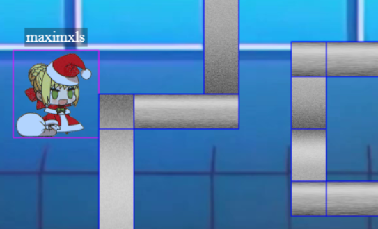
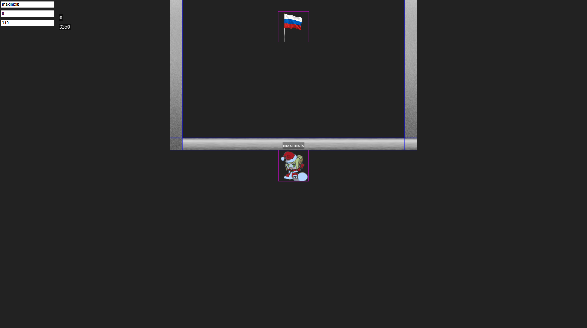

Чтобы упростить эксплуатацию, стоит завести override в инструментах разработчика в браузере.
Теперь можно поменять `self.girl.setCollideWorldBounds(true)` на `self.girl.setCollideWorldBounds(false)`. Так станет возможным выход за границы карты (сервер не знает про их существование). Для удобства еще закомментируем `this.cameras.main.setBounds(0, 0, 1920, 1080)` (убрать границы для камеры) и добавим `self.cameras.main.startFollow(self.girl, false, 0.05, 0.05, 0, 0)` в функцию `addPlayer` (заставить камеру следовать за игроком). Так, первая граница преодолена. Теперь можно включить режим debug:
```yaml
physics: {
    default: 'arcade',
    arcade: {
        debug: true
    }
},
```
и внести дополнитеыльные изменения (не буду вдаваться в подробности, там все просто) для того, чтобы убрать гравитацию и упростить полет. Однако, препятствия преодолеть просто так не получится, сервер проверяет, что игрок не проходит через стены.

В коде античита можно заметить `<` вместо `<=`, а также отсутствие проверки на деление на 0 в конце. Это приводит к тому, что любой наклонный отрезок никогда не пересекается с концом вертикального. То же самое можно сказать про два параллельных отрезка - их пересечение сервер не видит.

На карте можно заметить такие псевдо-щели:
\
Тут два препятствия касаются, но не пересекаются. Это значит, что при горизонтальной траектории через щель пересечения только с параллельными отрезками и концами вертикальных, а значит сервер эти пересечения не увидит. Так, первый флаг получается аккуратной модификацией позиции игрока сквозь эти щели.

Второй флаг находится под картой.
\
Здесь нет щелей, поэтому придется придумывать что-то новое. Коробка, в которой находится этот флаг, расположена на нулевой x-координате, поэтому в правильном месте можно двинуться на 1e-323 и точность не потеряется. Если проследовать по коду с этой мыслью, можно выяснить, что k1 обращается в бесконечность, а b1 из-за `k1*x1` ~ Infinity*0 обращается в NaN. Это ломает последующие проверки и позволяет спокойно телепортироваться в коробку.

В файле [./static/game.js](./static/game.js) находится мой чит (в виде модифицированного game.js). Поля слева сверху позволяют менять ник и обе координаты соответственно (нужно нажать enter). Shift+Up телепортирует вверх вместе с изменением x на 1e-323 (на ненулевых координатах это изменение теряется из-за точности).


